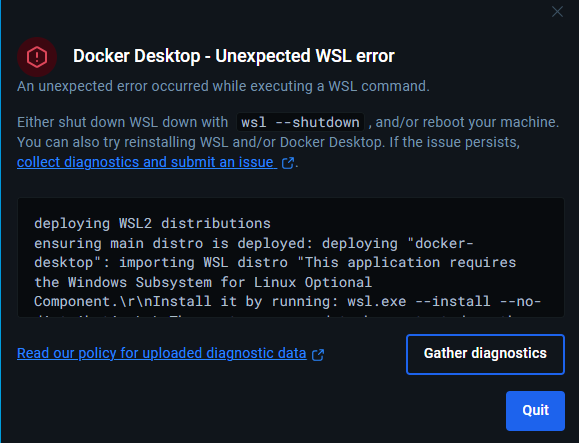
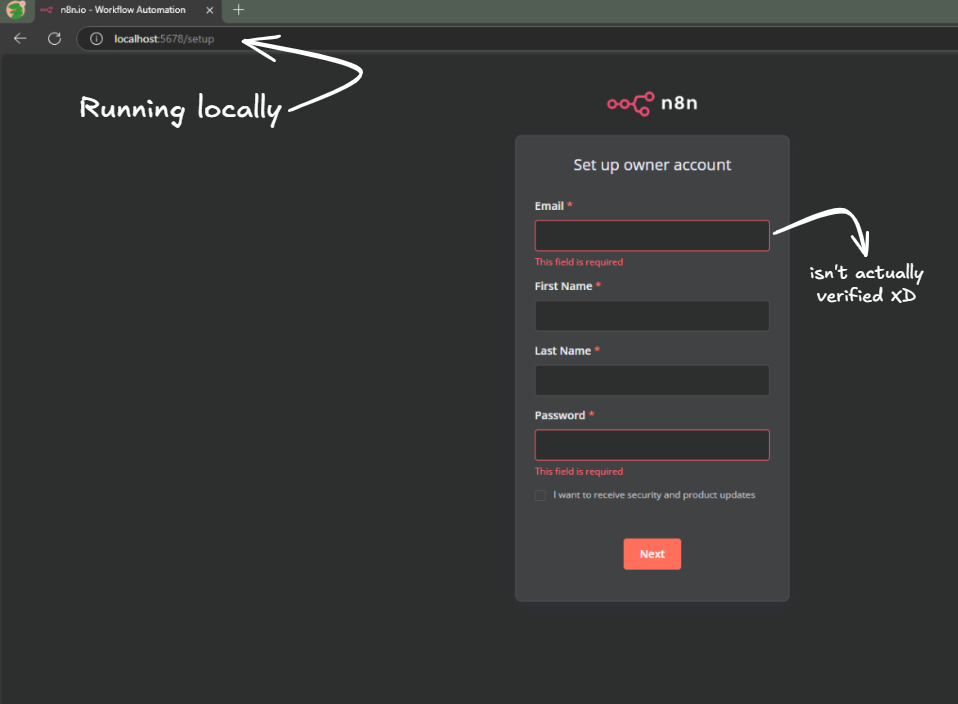
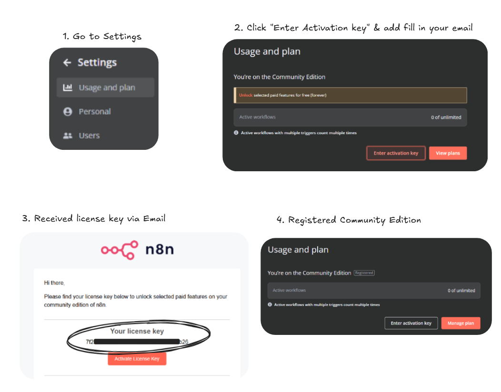
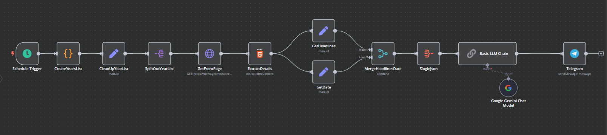
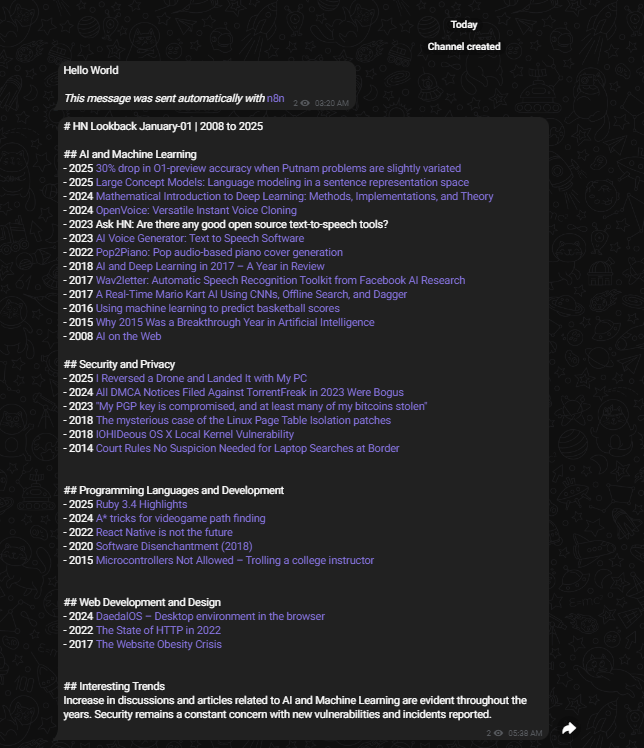

# Devlog 01 - January 1, 2025: Setting Up Docker, n8n and Hacker News Throwback Machine

Goals:
- [ ] Setup n8n locally on Windows
- [ ] Connect n8n with some LLM models


## Initial Docker Setup & the WSL Wall

I wanted to use Docker to spin up an n8n container. This means I first needed Docker to be up and running, which in turn required Windows Subsystem for Linux (WSL). I had recently formatted the machine, so didn't have any of it. I just followed the [instructions from Microsoft](https://learn.microsoft.com/en-us/windows/wsl/install), and ran the basic WSL installation command:

```
wsl --install
```

This enabled wsl. I could verify with `wsl -l`. I proceeded downloading `.exe` from [Docker Website](https://docs.docker.com/desktop/setup/install/windows-install/#install-interactively) and running it. Installation was smooth. However, I was immediately greeted with an error about a missing optional WSL component.

```
deploying WSL2 distributions
ensuring main distro is deployed: deploying "docker-desktop": importing WSL distro "This application requires the Windows Subsystem for Linux Optional Component.\r\nInstall it by running: wsl.exe --install --no-distribution\r\nThe system may need to be restarted so the changes can take effect.\r\nError code: Wsl/WSL_E_WSL_OPTIONAL_COMPONENT_REQUIRED\r\n" output="docker-desktop": exit code: 4294967295: running WSL command wsl.exe C:\Windows\System32\wsl.exe --import docker-desktop <HOME>\AppData\Local\Docker\wsl\main C:\Program Files\Docker\Docker\resources\wsl\wsl-bootstrap.tar --version 2: This application requires the Windows Subsystem for Linux Optional Component.
Install it by running: wsl.exe --install --no-distribution
The system may need to be restarted so the changes can take effect.
Error code: Wsl/WSL_E_WSL_OPTIONAL_COMPONENT_REQUIRED
: exit status 0xffffffff
```




This error message, while verbose, pointed to a specific missing component. The solution was straightforward, and I ran the command provided in the log:

```
wsl.exe --install --no-distribution
```

The process seemed to complete, but I was prompted that the changes would only take effect after a restart.  So I proceeded to reboot the system.

After rebooting I fired up the Docker Desktop App and tried starting it. I noticed it was having trouble starting the engine and this is error shown by Docker Desktop

```
running engine: waiting for the Docker API: engine linux/wsl failed to run: starting WSL engine: error spotted in wslbootstrap log: "[2025-01-01T18:18:59.355647499Z][wsl-bootstrap][F] expected digest 6fd972eac53e5427bd78f1ac807854ff79a4aa2bc226ebce1e898c43a7687fbf actual digest bb8c2b6a62ac29b2e030175df64de5b4b712fe6d58555cb7b3fc6eff64f783ed"
```

I ran a quick `docker` command from windows cmd and saw it gave an expected response. Following the instructions from [n8n docs for docker](https://docs.n8n.io/hosting/installation/docker/#starting-n8n) I ran 

```
docker volume create n8n_data
```

and got the following error

```
C:\Users\i>docker volume create n8n_data
error during connect: Post "http://%2F%2F.%2Fpipe%2FdockerDesktopLinuxEngine/v1.47/volumes/create": open //./pipe/dockerDesktopLinuxEngine: The system cannot find the file specified.
```


It wasn't clear what exactly was going on with the conflicting issues. I tried rechecking `wsl -l` a few more times it all seemed fine. 

Just to be sure I ran `wsl --install` again and this time I was asked to set up username and password for UNIX.

```
C:\Users\i>wsl --install
Ubuntu is already installed.
Launching Ubuntu...
Installing, this may take a few minutes...
Please create a default UNIX user account. The username does not need to match your Windows username.
For more information visit: https://aka.ms/wslusers
Enter new UNIX username: i
New password:
Retype new password:
passwd: password updated successfully
Installation successful!
To run a command as administrator (user "root"), use "sudo <command>".
See "man sudo_root" for details.

Welcome to Ubuntu 24.04.1 LTS (GNU/Linux 5.15.167.4-microsoft-standard-WSL2 x86_64)

 * Documentation:  https://help.ubuntu.com
 * Management:     https://landscape.canonical.com
 * Support:        https://ubuntu.com/pro

 System information as of Wed Jan  1 18:23:42 UTC 2025

  System load:  0.28                Processes:             33
  Usage of /:   0.1% of 1006.85GB   Users logged in:       0
  Memory usage: 5%                  IPv4 address for eth0: <redacted>
  Swap usage:   0%


This message is shown once a day. To disable it please create the
/home/i/.hushlogin file.
i@DESKTOP-<id>:~$ ls
i@DESKTOP-<id>:~$ pwd
/home/i
i@DESKTOP-<id>:~$ exit
logout
The operation completed successfully.
```

This seemed to solve the issue and I could continue with setting up n8n

## Setting Up n8n was actually easy*

\*given you have docker setup already

With WSL sorted, or so I thought, I moved on to the n8n installation. I used the official Docker documentation to create a data volume and spin up the container.


```
docker volume create n8n_data

docker run -it --rm --name n8n -p 5678:5678 -v n8n_data:/home/node/.n8n docker.n8n.io/n8nio/n8n
```


You are greeted with this login screen




You can also get a license key



## Hacker News Throwback Machine



This is a simple workflow that grabs HackerNews front-page headlines from today’s date across every year since 2007 and uses a little AI magic (Google Gemini) to sort 'em into themes, sends a neat Markdown summary on Telegram.

### Get Set Date

My first step was to create a recurring schedule using n8n's `Schedule Trigger`. I set it to run daily at `9 PM`. Then, I needed to generate a list of dates to fetch headlines for. The challenge was that I wanted headlines for this day across different years starting from 2007. 

Why 2007? Because HN itself was launched on February 19, 2007 and going any day further back gives us a blank page.

Essentially, we're looking at the Hacker News front page as it appeared on its anniversary each year, going back to its launch.

Therefore, for the current date of 2024-02-21, the URLs I listed are all potentially valid, and we should attempt to fetch from all of them:

```
https://news.ycombinator.com/front?day=2024-02-21
https://news.ycombinator.com/front?day=2023-02-21
https://news.ycombinator.com/front?day=2022-02-21
https://news.ycombinator.com/front?day=2021-02-21
https://news.ycombinator.com/front?day=2020-02-21
https://news.ycombinator.com/front?day=2019-02-21
https://news.ycombinator.com/front?day=2018-02-21
https://news.ycombinator.com/front?day=2017-02-21
https://news.ycombinator.com/front?day=2016-02-21
https://news.ycombinator.com/front?day=2015-02-21
https://news.ycombinator.com/front?day=2014-02-21
https://news.ycombinator.com/front?day=2013-02-21
https://news.ycombinator.com/front?day=2012-02-21
https://news.ycombinator.com/front?day=2011-02-21
https://news.ycombinator.com/front?day=2010-02-21
https://news.ycombinator.com/front?day=2009-02-21
https://news.ycombinator.com/front?day=2008-02-21
https://news.ycombinator.com/front?day=2007-02-21
```

That required a bit of JavaScript wizardry in the code node:

```
for (const item of $input.all()) {
  const currentDateStr = item.json.timestamp.split('T')[0];
  const currentDate = new Date(currentDateStr);
  const currentYear = currentDate.getFullYear();
  const currentMonth = currentDate.getMonth(); // 0 for January, 1 for February, etc.
  const currentDay = currentDate.getDate();

  const datesToFetch = [];
  for (let year = currentYear; year >= 2007; year--) {
    let targetDate;
    if (year === 2007) {
      // Special handling for 2007 to start from Feb 19
      if (currentMonth > 1 || (currentMonth === 1 && currentDay >= 19))
      {
        targetDate = new Date(2007, 1, 19); // Feb 19, 2007
      } else {
        continue; // Skip 2007 if currentDate is before Feb 19
      }
    } else {
      targetDate = new Date(year, currentMonth, currentDay);
    }
    
    // Format the date as YYYY-MM-DD
    const formattedDate = targetDate.toISOString().split('T')[0];
    datesToFetch.push(formattedDate);
  }
  item.json.datesToFetch = datesToFetch;
}

return $input.all();
```

I gave some prompt and few examples and let gemini generate the code, I validated with a bunch of different values and it seems to work fine. 


Next the array of dates was cleaned up to only contain the array and nothing else using a Set node.

### Scrape the Data

The `Split Out` node was used to iterate through each of the individual dates, which I passed to the `HTTP Request` node. This node was configured to send `GET requests` to the Hacker News front page, while iterating through the dates.

Then it was time to extract the relevant information from the HTML response using the `HTML Extractor` node. I targeted the headline text and its corresponding URL and also extracted the date.

I used `set` nodes to extract the headlines and the date into separate json properties and used a `Merge` node to bring together the headlines and date for each specific iteration of the SplitOut node. Then, I used a single `Aggregate` node to combine all the data into one single JSON.

### AI Magic

The core of the workflow was to summarize all those articles using an LLM. I used a Basic LLM Chain with a very detailed prompt:

````
You are a highly skilled news categorizer, specializing in indentifying interesting stuff from Hacker News front-page headlines.

You are provided with JSON data containing a list of dates and their corresponding top headlines from the Hacker News front page. Each headline will also include a URL linking to the original article or discussion. Importantly, the dates provided will be the SAME DAY across MULTIPLE YEARS (e.g., January 1st, 2023, January 1st, 2022, January 1st, 2021, etc.). You need to indentify key headlines and also analyze how the tech landscape has evolved over the years, as reflected in the headlines for this specific day.

Your task is to indentify top 10-15 headlines from across the years from the given json data and return in Markdown formatted bullet points categorizing into themes and adding markdown hyperlinks to the source URL with Prefixing Year before the headline. Follow the Output Foramt Mentioned.

**Input Format:**

```json
[
  {
    "headlines": [
      "Headline 1 Title [URL1]",
      "Headline 2 Title [URL2]",
      "Headline 3 Title [URL3]",
      ...
    ]
    "date": "YYYY-MM-DD",
  },
  {
    "headlines": [
      "Headline 1 Title [URL1]",
      "Headline 2 Title [URL2]",
      ...
    ]
    "date": "YYYY-MM-DD",
  },
  ...
]
```

**Output Format In Markdown**

```
# HN Lookback <FullMonthName-DD> | <start YYYY> to <end YYYY> 

## [Theme 1]
- YYYY [Headline 1](URL1)
- YYYY [Headline 2](URL2)
...

## [Theme 2]
- YYYY [Headline 1](URL1)
- YYYY [Headline 2](URL2)
...

... 

## <this is optional>
<if any interesing ternds emerge mention them in oneline>
```

**Here is the Json data for Hackernews Headlines across the years**

```
{{ JSON.stringify($json.data) }}
```
````


I fed the aggregated JSON data into this chain, and to make use of a specific LLM, I connected the chain to a `Google Gemini Chat Model` node. Finally, I used the `Telegram` node to send the Markdown-formatted summary to a designated Telegram chat.

### Telegram Message

You can see the the final message that is being sent to telegram here.


