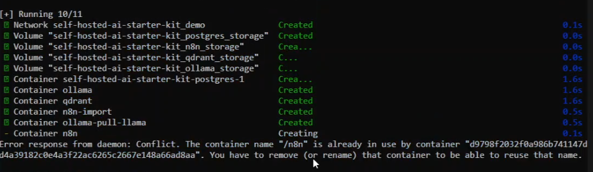
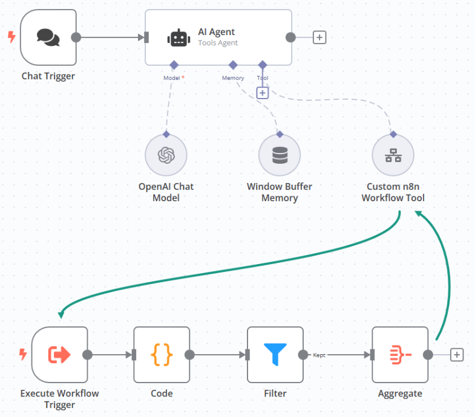
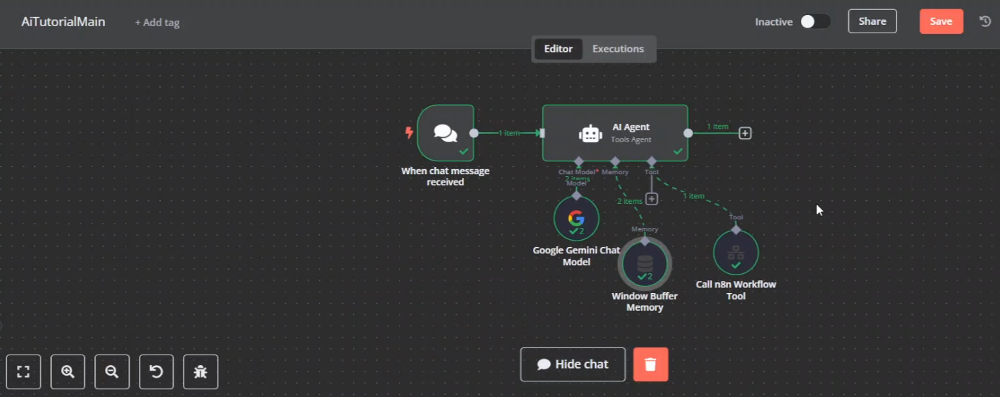
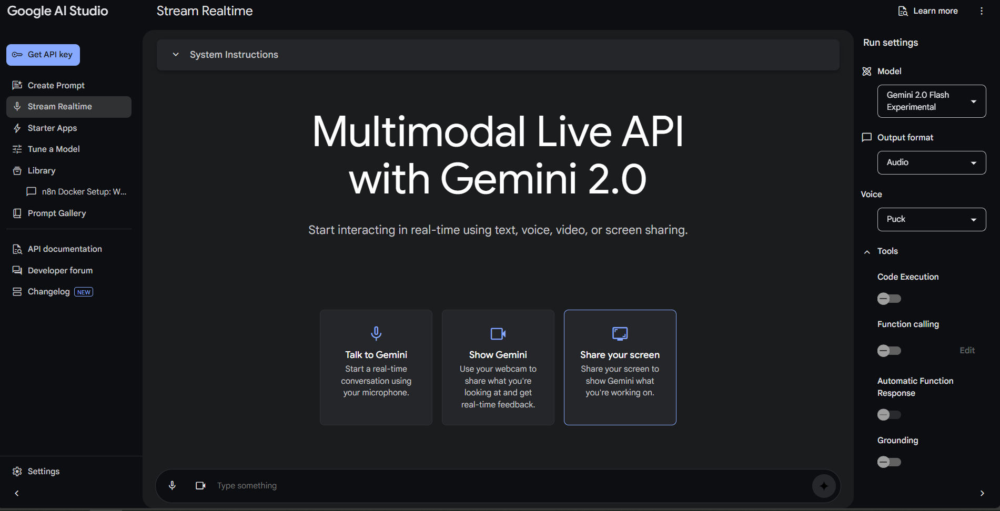
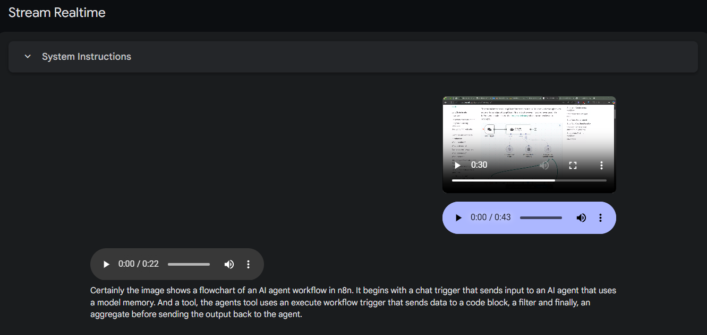
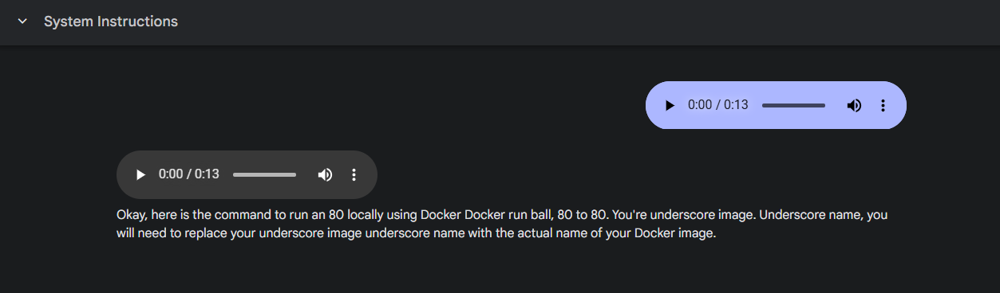
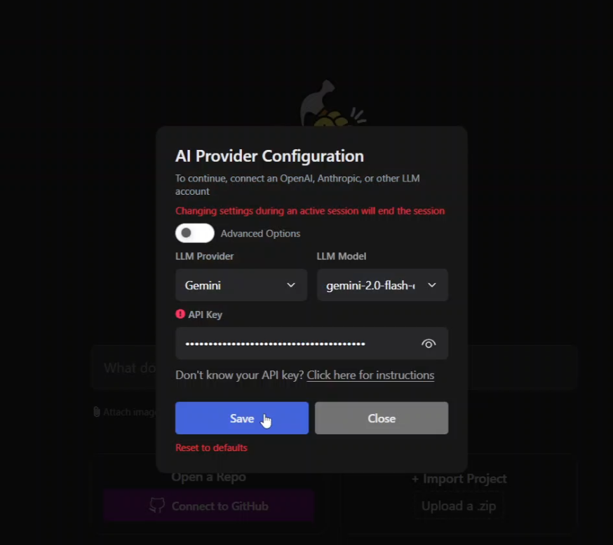
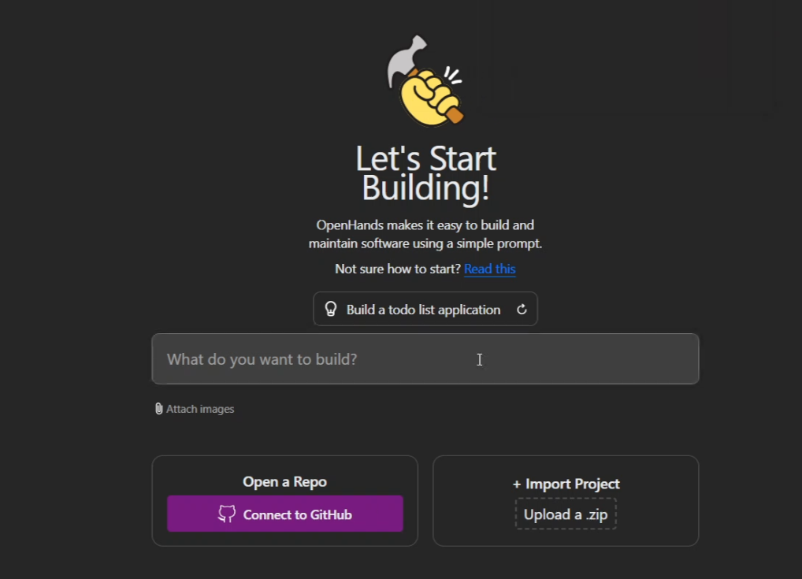
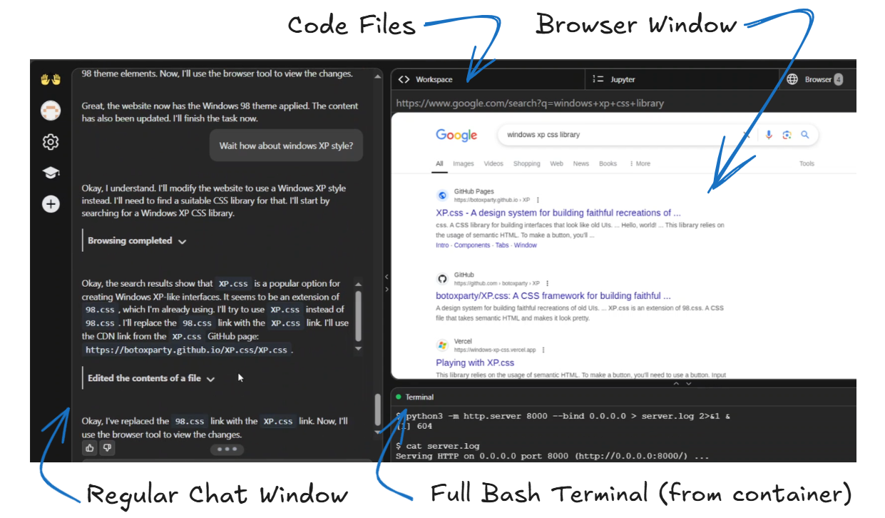
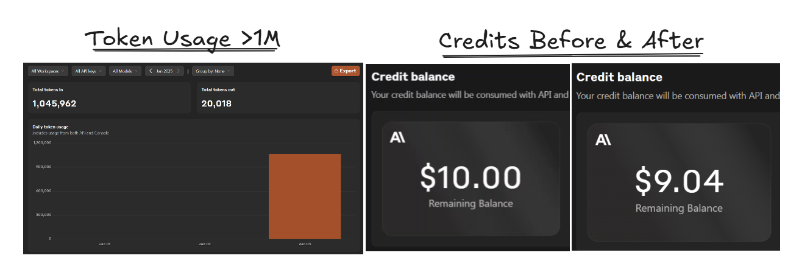

# Devlog 02 - January 2, 2025: Talking to Gemini, Basic Web Dev with OpenHands

ToDo: 
- [ ] Read through https://docs.n8n.io/advanced-ai/ and try all examples

Finished:
- [x] n8n Ai tutorial example
- [x] Creating WinXP style website with OpenHands


## n8n Ai Workflows

I wanted to try [n8n advanced ai tutorial](https://docs.n8n.io/advanced-ai/intro-tutorial/).

### n8n Ai Starter Kit

Sometime yesterday while reading the documentation, I stumbled upon n8n powered [Self-hosted AI Starter Kit](https://github.com/n8n-io/self-hosted-ai-starter-kit). It looks very promising.


[From n8n documentation](https://docs.n8n.io/hosting/starter-kits/ai-starter-kit/#whats-included)

> What’s included  
> ✅ Self-hosted n8n: Low-code platform with over 400 integrations and advanced AI components.  
> ✅ Ollama: Cross-platform LLM platform to install and run the latest local LLMs.  
> ✅ Qdrant: Open-source, high performance vector store with a comprehensive API.  
> ✅ PostgreSQL: The workhorse of the Data Engineering world, handles large amounts of data safely.  
> 
> What you can build  
> ⭐️ AI Agents that can schedule appointments  
> ⭐️ Summaries of company PDFs without leaking data  
> ⭐️ Smarter Slackbots for company communications and IT-ops  
> ⭐️ Private, low-cost analyses of financial documents  

I followed the instructions to clone the repo and spin up using docker compose

```
git clone https://github.com/n8n-io/self-hosted-ai-starter-kit.git
cd self-hosted-ai-starter-kit
docker compose --profile cpu up
```

I was able to pull required images but I couldn't get it spin up because of some issue with name conflicts i.e., already existing container with same name n8n.



I could've tried renaming the previous one and retrying but I just continued with pre-existing setup as it would suffice me for now. Will come back to this setup some other day.

### n8n Ai Tutorial

Since, I had the previous setup already. I ran the same `docker run` command and had a container neatly running with pre-existing n8n data and configs.

```
docker run -it --rm --name n8n -p 5678:5678 -v n8n_data:/home/node/.n8n docker.n8n.io/n8nio/n8n
```

Now, I can just focus on building with n8n instead of fidling with docker. Looking at the workflow, it doesn't have many nodes or complex setup. 




It's described in [documentation](https://docs.n8n.io/advanced-ai/intro-tutorial/#:~:text=It%20uses%20the%20Chat%20Trigger%20to%20simulate%20and%20test%20chat%20interactions%2C%20ChatGPT%20to%20power%20the%20chat%20functionality%2C%20and%20a%20custom%20tool%20to%20connect%20to%20other%20n8n%20workflows.) as 

>  ... uses the Chat Trigger to simulate and test chat interactions, ChatGPT to power the chat functionality, and a custom tool to connect to other n8n workflows.

 




## Talking to Gemini

Since the [launch of Gemini 2.0](https://developers.googleblog.com/en/the-next-chapter-of-the-gemini-era-for-developers/) I was super excited about mutlimodal [demo showing live screen share + voice chat](https://youtu.be/9hE5-98ZeCg). I finally got around to playing with it.

### Testing Gemini Live



It is accessible via https://aistudio.google.com/u/1/live. Obviously need to give it microphone and screen share permissions. 

There isn't any trigger word as such, it just continously watches the screen and listens through microphone and triggered whenever it can catch some audio (there were a few false postivies too, where it picked up on background noise). 

It has 5 customizable voice modes, I personally liked `Aoede` and `Puck`. 

Whenever it picks up some audio, it sends last few seconds of the screen along with the recorded audio. It starts speaking the response and also gives it as a text output in the chat window.



### Screaming 'SHUT UP' kinda works?

Sometimes Gemini goes on and on talking, and you just want it to stop. I tried a bunch of words and phrases but screaming 'SHUT UP' works better. Idk why this works but it does ¯\\\_(ツ)_/¯ 

### Towards Better Conversations with Gemini Live

Whenever asked something it starts with repating the question, explaining what already visible on screen or summarizing question then proceeds to talk about the actual response and then ends with "let me know if you need anything" or "I'm always here to help". Though people might like these mannerisms I persnoally find this approach very slow. I would always appreciate a respones with max brevity. All mannerisms can go out the window.   

That's exactly how I prompted it next, and it greatly improved my experience. 

```
Hey! I'm <my role relevant to task>. I've started working on <high level summary>. My goal for now is <task broken down>.

I want you to act as my pair programmer, silently observing my screen, taking a note of everything that I do.

Please don't repeat what you can already see on the screen or what you are about to do or asking to offer help. I know that already.

Only respond to the questions you've been explicitly asked to answer and do it in the most concise manner with the highest brevity.

Othewise, If I provide you with any information, don't immediately reply back if you don't have anything valuable to add. Just respond with "okay" so that I know you've acknowleged it.

Do you understand?

```

 ### Gemini output for text and audio is hardlinked

 

 Sometimes I just want it to give me a long command as a text in the chat without it having to actually read it, I don't know why but this isn't working nicely.


 ## OpenHands - Agentic Development

 ### Getting Started with OpenHands

 I got to know about OpenHands from this video on [Agents in 2024 - Latent Space YT](https://www.youtube.com/watch?v=B6PKVZq2qqo), I learned about [SWE-bench](https://www.swebench.com/) which asks *Can Language Models Resolve Real-World GitHub Issues?* question. I think this is a reasonable metric and hence decided to start working with it.

Following the [documentation](https://docs.all-hands.dev/modules/usage/installation), Setting it up was very simple. Just needed to run these two commands.

```
docker pull docker.all-hands.dev/all-hands-ai/runtime:0.18-nikolaik

docker run -it --rm --pull=always \
    -e SANDBOX_RUNTIME_CONTAINER_IMAGE=docker.all-hands.dev/all-hands-ai/runtime:0.18-nikolaik \
    -e LOG_ALL_EVENTS=true \
    -v /var/run/docker.sock:/var/run/docker.sock \
    -v ~/.openhands-state:/.openhands-state \
    -p 3000:3000 \
    --add-host host.docker.internal:host-gateway \
    --name openhands-app \
    docker.all-hands.dev/all-hands-ai/openhands:0.18
```

I had to modify the docker run command to remove the line breaks and turn it into a single line to be able to paste directly in the terminal and run.

```
docker run -it --rm --pull=always -e SANDBOX_RUNTIME_CONTAINER_IMAGE=docker.all-hands.dev/all-hands-ai/runtime:0.18-nikolaik -e LOG_ALL_EVENTS=true -v /var/run/docker.sock:/var/run/docker.sock -v ~/.openhands-state:/.openhands-state -p 3000:3000 --add-host host.docker.internal:host-gateway --name openhands-app docker.all-hands.dev/all-hands-ai/openhands:0.18
```

The web UI was accessible via http://localhost:3000. Navigating to it, I was pleased to see no sign up questions being asked (except for one, sending usage data). I had to setup the model to use with openhands.



I selected to opt for Gemini 2.0 Flash Experimental. I created an API key from [Google Studio Api Keys](https://aistudio.google.com/apikey) and pasted here. Later, I switched to Anthropic Claude Sonnet 3.5 [as suggest in the github](https://github.com/All-Hands-AI/OpenHands#-quick-start) readme.

The main sreen of the App is also rather simple, similar to any other Ai chat app with one large text box. 



I later connected with with Github too, by [creating a Personal Access Token](https://docs.github.com/en/authentication/keeping-your-account-and-data-secure/managing-your-personal-access-tokens).

Time to start building something interesting.

### OpenHands - Working Screen



I like this layout. I think this is a step up from my existing cursor+browser setup. From this UI, I don't really need to switch to anything else. The terimnal, the code files, the browser window and even Jupyter notes are all right on the face. Don't need to switch back and froth.

My only complaint with browser is that it just displays a static image instead of an actual interactive browser. This [feature requested was already submitted on Github](https://github.com/All-Hands-AI/OpenHands/issues/4389) but I don't see any active progess on it. I hope this get fixed soon.

The above screenshot captures also my "ahaaa moment" when I realised rather than relying only on training data, it could even just browse the web and figure out stuff too. (here finding windows xp style library) 

### Windows XP style Web Page

I needed a temporary landing for my domain ibrh.me where I plan to host everything eventually. I could definetly use some Agentic help. I created a [new repo on github](https://github.com/ibrhdotme/ibrh.me) and gave openhands access to it.

I started with this rather simple prompt

```
I want you to create me a simple one-page personal website, with windows XP aesthetic. Just use html / css / js. It will be hosted on ibrh.me.

Run the website using a http server and render the output in the browser tool.

Website should Have the following content ibrh.me in big text along with just links to my github and twitter both of whose usernames are @ibrhdotme, use favicons or svgs to instaed of images for github and twitter logos
```

Going forward I only asked it to make a few tweaks here and there and let it do most of the heavy lifiting. Later, also asked it to add a 3d pipes from Windows XP as screensaver. I couldn't realy build 3d pipes but it somehow resulted in some flashy lines and dots, I just let that be. I didn't write any of the code, I was just asking it to modify things and watching do the heavy lifting.

It even [raised a PR](https://github.com/ibrhdotme/ibrh.me/pull/1) and added a summary description in PR it using my account. Though the [code change commit is by @openhands-agent](https://github.com/ibrhdotme/ibrh.me/pull/1/commits) itself.

Later I manaully set up dns and hosted it via Cloudflare pages. Since, the domain will obviously be updated some actual content, I've archived the initial version. It can be [viewed here on wayback machine.](https://web.archive.org/web/20250103204344/https://ibrh.me/)


### So, How much did this simple site cost me?



I added $10 at start. I was surprised to see how quickly $1 and 1M tokens was spent. If I had spent a few more hours playing around with it, I would've easily exhaused all $10. I moved back to the Gemini as it currently doesn't charge anything but this could change anytime.

I don't mind spending more $$$ for credits but I can't keep up if i had to spend rs 1000-2000 everyday just to playaround. 

I will try to explore llama and other open models next time as they run locally and would practically cost nothing.