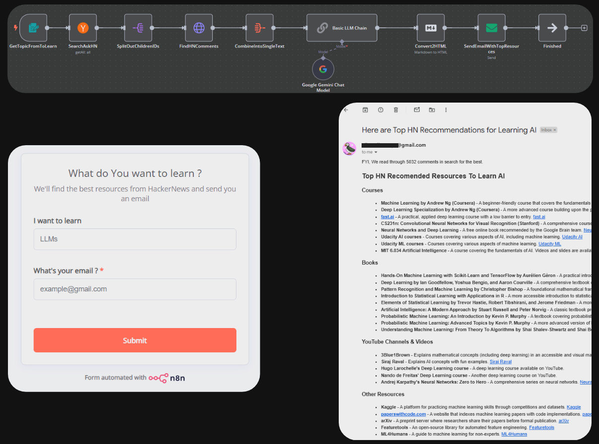

# Devlog 03 - January 3, 2025: Learn Anything From HackerNews, can't send back form data

## Building HN based simple recommendation Engine



Whenever I find get to know about any thing new and interesting I look it up on reddit and hackernews. I have always found really great community recommended resources on these platforms.  

### How it works

- Submit a simple form with what you want to learn
- Workflow scrapes 'Ask HN' posts and their top comments one level deep
- LLM process it all and gives suggestions
- A Markdown formatted email with links is sent to the user

### Couldn't figure out a way to return data back

I wanted to be able to return back the recommendations straight via another form node but that didn't work. Though using a simple workflow with just two form nodes, I was able to get it to display "Hello <Name>" when "<Name>" was captured in first trigger node.

Maybe I am missing something obvious with how the form node responds back but tried a million different things but couldn't figure out a simple way to respond back. 


### Simple SMTP based Email to resuce

Setting up an smtp based email was rather easy. I just followed the [docs](https://docs.n8n.io/integrations/builtin/credentials/sendemail/gmail/) and to my surprise everything worked in the first go.


### Reccomendation Engine prompt 

I wrote this rather simple prompt 

````
Your Task is to find the best resources to learn <Topic Name Captured from form>. 

I have scraped the HackerNews and The following is the list of comments from HackerNews on topic about Learning <Topic Name Captured from form>

Focus only on comments that provide any resouces or advice or insight about learning <Topic Name Captured from form>. Ignore all other comments that are off topic discussions.

Now based on these comments, you need to find the top resources and list them. 

Categorize them based on resource type (course, book, article, youtube videos, lectures, etc) and also figure out the difficultiy level (beginner, intermediate, advanced, expert).

You don't always to have fill in these categories exactly, these are given here for reference. Use your intution to find the best categorization.

Now based on these metrics and running a basic sentiment analysis on comments you need to figure out what the top resources are. 

Respond back in Markdown formatted text. In the following format

**OUTPUT FORMAT**

```
## Top HN Recomended Resources To Learn <topic Name> 

### Category 1

- **Resource 1** - One line description
- **Resource 2** - One line description
- ... 

<add hyperlinks if any exists>

### Category 2

- **Resource 1** - One line description
- **Resource 2** - One line description
- ... 

<add hyperlinks in markdown format to the resource name itself if any exists. Example [resource name](https://example.com)>
...
```

Here is the list of HackerNews Comments.

<HackerNews comments scraped from 'Ask HN' with matching <Topic Name Captured from form> as a single list without any further processing>
````