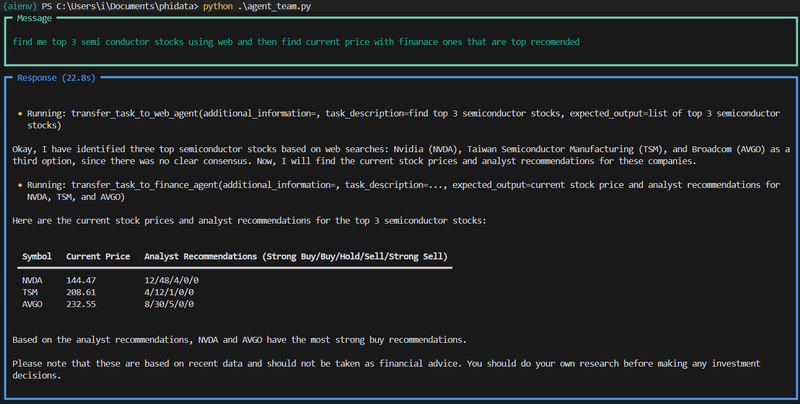

# Devlog 04 - January 4, 2025: Getting Started with Phidata



## Inital Setup 

Since Phidata currently runs locally. I had to install python. I got lastest 3.13.1 version from [python website](https://www.python.org/downloads/). Next, I just followed the [Phidata docs - setup instructions](https://docs.phidata.com/introduction#setup). 

```
python3 -m venv aienv
aienv/scripts/activate
```

Oh that's easy just creating a virtual environment and activating it. I done it a million times already. or So I thought. And immediately was greeted with this error 

```powershell
PS C:\Users\i\Documents\phidata> .\aienv\Scripts\activate

.\aienv\Scripts\activate : File C:\Users\i\Documents\phidata\aienv\Scripts\Activate.ps1 cannot be loaded because

running scripts is disabled on this system. For more information, see about_Execution_Policies at

https:/go.microsoft.com/fwlink/?LinkID=135170.

At line:1 char:1

+ .\aienv\Scripts\activate

+ ~~~~~~~~~~~~~~~~~~~~~~~~

    + CategoryInfo          : SecurityError: (:) [], PSSecurityException

    + FullyQualifiedErrorId : UnauthorizedAccess
```

That's a new one, following the link I tried to read up more on [PowerShell Execution Policies](https://learn.microsoft.com/en-us/powershell/module/microsoft.powershell.core/about/about_execution_policies?view=powershell-7.4). Apart from knowing there is a permission issue, I couldn't figure out much.

I just decided to bypass this restriction, asking gemini I got these suggestions 

To disable temporarily, run this in powershell

```powershell
Set-ExecutionPolicy RemoteSigned -Scope Process
```

And to permanently disable need,

```powershell
Set-ExecutionPolicy RemoteSigned -Scope CurrentUser -Force
```

After disabling this security warning I was able to activate the virtual environment. I then installed the basic required libraries 

```
pip install -U phidata openai duckduckgo-search
```

And setting api key

```
setx OPENAI_API_KEY sk-***
```

Though I got a success message here, It wasn't able to pick it up. Later, I had to manually pass the `api_key` straight from the code when specifying the model.

## Using Gemini instead of OpenAi

I wanted to first try out some free model before paying OpenAI again with API credits. So I opted to used Gemini instead for the rest of the code examples.

I got the key from [Google Ai Studio](https://aistudio.google.com/u/0/apikey), It provides a generous free tier thats enough to get started. Though there are some [limtations](https://ai.google.dev/pricing), obviously.

I had make the following modifications

```diff
# Change the imports
- from phi.model.openai import OpenAIChat
+ from phi.model.google import Gemini

# Changing the model name and also passing the key
- model=Gemini(id="gemini-2.0-flash-exp",api_key="REDACTED - ACTUAL API KEY GOES HERE")
+ model=OpenAIChat(id="gpt-4o")

# Adding this line in Agent() because by default it uses and expects OPENAI KEY
agent_team = Agent(
+    model=Gemini(id="gemini-2.0-flash-exp",api_key="REDACTED - ACTUAL API KEY GOES HERE"),
    team=[web_agent, finance_agent],
    instructions=["Always include sources", "Use tables to display data"],
    show_tool_calls=True,
    markdown=True,
)
```

After this I was able to run through some code Examples. 
Code is along with some comments is saved in [phidataCode.py](phidataCode.py)

## Next Steps

I want to connect it to [more tools](https://docs.phidata.com/tools/introduction) and also try out the more of these [example agents](https://docs.phidata.com/examples/introduction)
