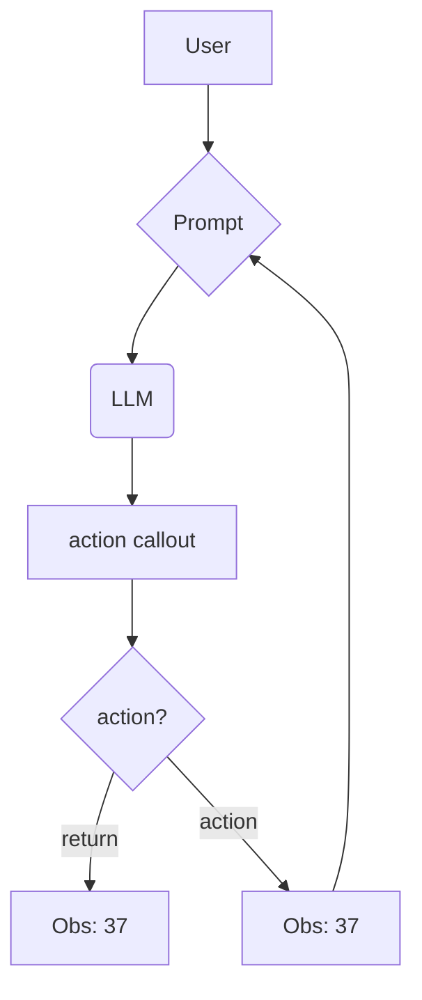
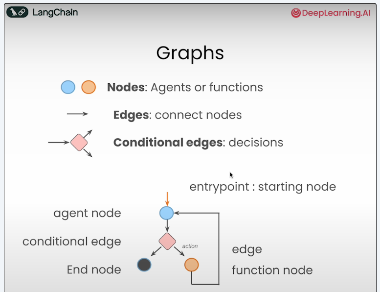
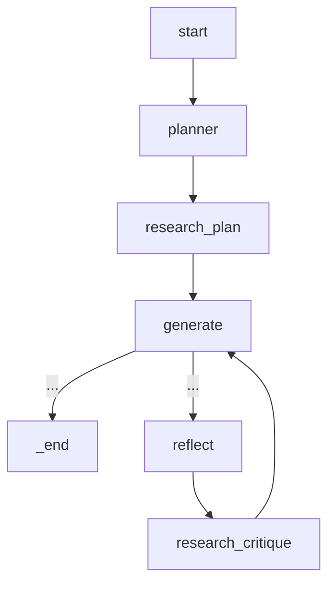
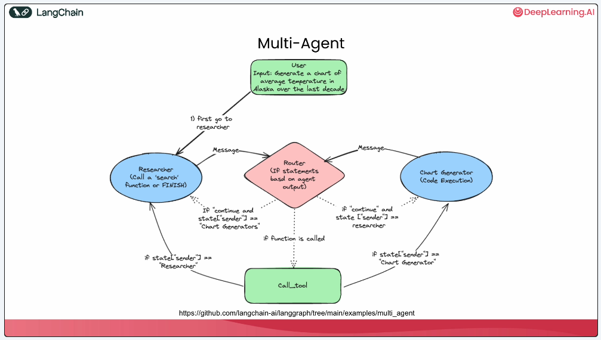
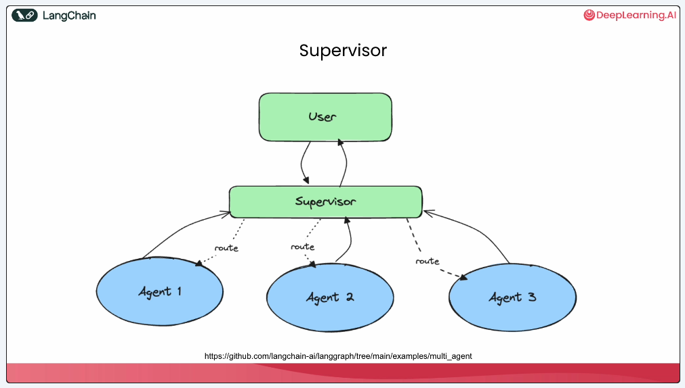
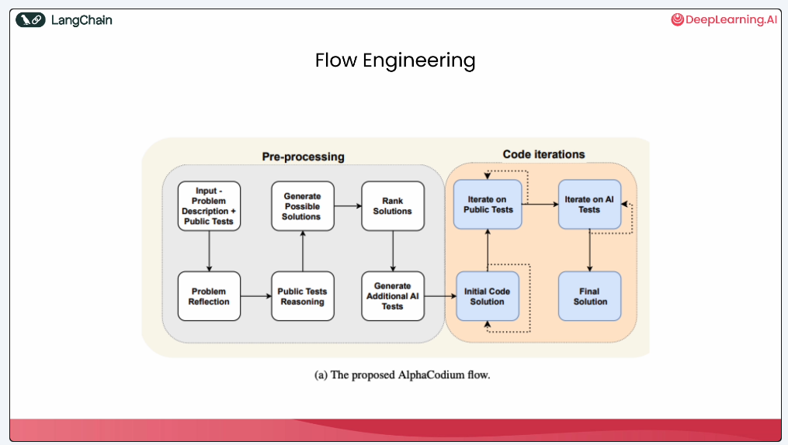
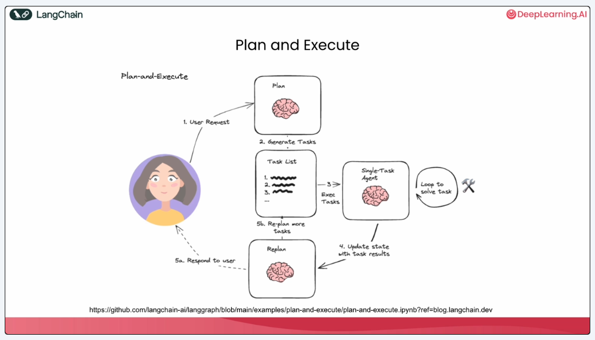

# AI Agents in LangGraph Course Notes

- 🔗 https://www.deeplearning.ai/short-courses/ai-agents-in-langgraph/
- ⌛ ~1hr
- 👥 Harrison Chase (LangChain) & Rotem Weiss (Tavily)
- 📅 05-07 Jan, 2025

## Lesson 00: Introduction 

- Tool use has been imporved a lot since last year
- Agentic workflow (design patterns)
    - iterative
    - planning / thinking
    - tools use
    - reflection 
    - mutli agent comms
    - memory

- Paradigms / Papers
    - behaviour is defined by a cyclical graph
    - [ReAct: Synergizing **Re**asoning and **Act**ing in Language Models](https://arxiv.org/abs/2210.03629)
    - [Self-Refine: Iterative Refinement with Self-Feedback](https://arxiv.org/abs/2303.17651)
    - [Code Generation with AlphaCodium: From Prompt Engineering to Flow Engineering](https://arxiv.org/abs/2401.08500)

- Agentic capabilites
    - **Recieve Human input** to guide at critical points
    - **Persistence** to store current state of information

## Lesson 01: Build an Agent from Scratch

Code in this file.

- Creating a simple pythonic agent class

```python

class Agent:

    # let user pass a system message
    # keep track of messages via a list
    # append system message to that list
    def __init__(self, system=""):
        self.system = system
        self.messages = []
        if self.system:
            self.messages.append({"role": "system", "content": system})

    # append message to the list
    # execute?
    # append its result to the list
    def __call__(self, message):
    self.messages.append({"role": "user", "content": message})
    result = self.execute()
    self.messages.append({"role": "assistant", "content": result})
    return result

    # use any llm (openai here) for completion
    # making it very deterministic by setting temp to zero
    # add back response from model to the list
    def execute(self):
    completion = client.chat.completions.create(
                    model="gpt-4o", 
                    temperature=0,
                    messages=self.messages)
    return completion.choices[0].message.content
```

- Creating a ReAct agent
- Workings in the following loop
    - Thought 
    - Action 
    - Execution
    - Observation
    - Repeat


```python

###################################
# defining prompt and agentic tools
###################################

prompt = """
You run in a loop of Thought, Action, PAUSE, Observation.
At the end of the loop you output an Answer
Use Thought to describe your thoughts about the question you have been asked.
Use Action to run one of the actions available to you - then return PAUSE.
Observation will be the result of running those actions.

Your available actions are:

calculate:
e.g. calculate: 4 * 7 / 3
Runs a calculation and returns the number - uses Python so be sure to use floating point syntax if necessary

student_average_grade:
e.g. student_average_grade: Rahul
returns average grade of a student when given the name

Example session:

Question: How much did Rahul grade ?
Thought: I should look the rahul's grade using student_average_grade
Action: student_average_grade: Rahul
PAUSE

You will be called again with this:

Observation: Rahul average grade is 51.

You then output:

Answer: Rahul average grade is 51.
""".strip()

def calculate(what):
    return eval(what)

def student_average_grade(name):
    if name in "Om": 
        return("Om average grade is 70")
    elif name in "Jay":
        return("Jay average grade is 80")
    elif name in "Jagdesh":
        return("Jagesh average grade is 7 90")
    else:
        return("average student grade is 50")

known_actions = {
    "calculate": calculate,
    "student_average_grade": student_average_grade
}

######################################
# working with agent
######################################
# here we are manually calling 
# tools and managing the message list  
######################################


abot = Agent(prompt)
result = abot("How much did a average sutdent score?")
print(result)
# Thought: To find out how much an average student scored, I need to calculate the average of all students' average grades. I will first need to gather the average grades of all students and then calculate the overall average.
# Action: student_average_grade: Rahul
# PAUSE

result = student_average_grade("John")
result
# 'average student grade is 50'

next_prompt = "Observation: {}".format(result)
abot(next_prompt)
# 'Answer: The average student scored 50.'

abot.messages
# [{'role': 'system',
#   'content': "You run in a loop of Thought, Action, PAUSE, Observation.\nAt the end of the loop you output an Answer\nUse Thought to describe your thoughts about the question you have been asked.\nUse Action to run one of the actions available to you - then return PAUSE.\nObservation will be the result of running those actions.\n\nYour available actions are:\n\ncalculate:\ne.g. calculate: 4 * 7 / 3\nRuns a calculation and returns the number - uses Python so be sure to use floating point syntax if necessary\n\nstudent_average_grade:\ne.g. student_average_grade: Rahul\nreturns average grade of a student when given the name\n\nExample session:\n\nQuestion: How much did Rahul score ?\nThought: I should look the rahul's score using student_average_grade\nAction: student_average_grade: Rahul\nPAUSE\n\nYou will be called again with this:\n\nObservation: Rahul average score is 51.\n\nYou then output:\n\nAnswer: Rahul average score is 51."},
#  {'role': 'user', 'content': 'How much did a average sutdent score?'},
#  {'role': 'assistant',
#   'content': "Thought: To find out how much an average student scored, I need to calculate the average of all students' average grades. I will first need to gather the average grades of all students and then calculate the overall average.\nAction: student_average_grade: Rahul\nPAUSE"},
#  {'role': 'user', 'content': 'Observation: average student grade is 50'},
#  {'role': 'assistant', 'content': 'Answer: The average student scored 50.'},
#  {'role': 'user', 'content': 'Observation: average student grade is 50'},
#  {'role': 'assistant', 'content': 'Answer: The average student scored 50.'}]

##########################################
# auto handle tool calling and message list
##########################################

# python regular expression to selection action
action_re = re.compile('^Action: (\w+): (.*)$')   

# start an agent with default system prompt
# let it run through max_turn iterations 
# if there are any actions in response 
# pass them to appropriate tools (functions) and store result
# repeat
def query(question, max_turns=5):
    i = 0
    bot = Agent(prompt)
    next_prompt = question
    while i < max_turns:
        i += 1
        result = bot(next_prompt)
        print(result)
        actions = [
            action_re.match(a) 
            for a in result.split('\n') 
            if action_re.match(a)
        ]
        if actions:
            # There is an action to run
            action, action_input = actions[0].groups()
            if action not in known_actions:
                raise Exception("Unknown action: {}: {}".format(action, action_input))
            print(" -- running {} {}".format(action, action_input))
            observation = known_actions[action](action_input)
            print("Observation:", observation)
            next_prompt = "Observation: {}".format(observation)
        else:
            return

question = """we are creating a student group with om and jay and ram, find the average score of this group"""
query(question)

# Thought: I need to find the average score of each student (Om, Jay, and Ram) and then calculate the average of these scores to find the group's average score.
# Action: student_average_grade: Om
# PAUSE
#  -- running student_average_grade Om
# Observation: Om average grade is 70
# Thought: I have Om's average grade. Now, I need to find Jay's average grade.
# Action: student_average_grade: Jay
# PAUSE
#  -- running student_average_grade Jay
# Observation: Jay average grade is 80
# Thought: I have the average grades for Om and Jay. Now, I need to find Ram's average grade.
# Action: student_average_grade: Ram
# PAUSE
#  -- running student_average_grade Ram
# Observation: average student grade is 50
# Thought: I now have the average grades for Om, Jay, and Ram. I will calculate the average of these three grades to find the group's average score.
# Action: calculate: (70 + 80 + 50) / 3
# PAUSE
#  -- running calculate (70 + 80 + 50) / 3
# Observation: 66.66666666666667
# Answer: The average score of the student group consisting of Om, Jay, and Ram is approximately 66.67.
```

## Lession 02: LangGraph Components

Code in this file.



- LangGraph core feature is describing and orchestrating control flow 
- Allows creation of cyclic graphs with built in persistence
- Agent state is accessible to all parts of graph
- Can be persisted, be able to resume anytime (timetravel)



- Working with LangGraph
    - Define agent
    - Add nodes to the graph
    - Connect via edges
    - Set graph entry point
    - Set the conditional nodes
    - Define tools and bind them to model

- Parallel tool / function calling 
    - Runs same task with different paramaters (finding weather for cities)
    - Saves additional overhead of llm being called after each finished tool call


## Lesson 03: Agentic Search Tools

Code in this file.

- Agentic search tools provides a much better interface then using regular search / scraping
- The response can directly be used by llm without any further processing


## Lesson 04: Persistence and Streaming

Code in this file.

- Use `thread_id` for persistence
- This adds context for messages, So we can can be a bit ambigious (this, that, first, before ... etc)
- External databases can also be used to store this persistent state memory
- Streaming allows to directly print to user while its getting data / processing it

## Lesson 05: Human in the loop

Code in this file.

- We need human in the loop to allow / restrict certain tool actions in right context
- While compling the graph, also add a `interrupt_before` along with `checkpointer`
- Can be specified to only interput for certain tools
- Timetravel is possible by accessing previous states from memory
- This state can be modified and even updated back into the memory
- This results in branching off from the original and helps keep history tree

## Lesson 06: Essay Writer



- Plan, Write, Reflect, Research, Critique etc
- Creating nodes for each of these subtasks also custom prompt
- Build graph with these nodes and add edges


## Lesson 07: LangChain Resources

- LangChain: [Docs](https://python.langchain.com/docs/introduction/) | [Github](https://github.com/langchain-ai/langchain) 
- LangGraph: [Docs](https://langchain-ai.github.io/langgraph/) | [Github](https://github.com/langchain-ai/langgraph)
- Courses: [DeepLearning](https://www.deeplearning.ai/courses/?courses_date_desc%5BrefinementList%5D%5Bpartnership%5D%5B0%5D=LangChain) | [LangChain Academy](https://academy.langchain.com/courses/intro-to-langgraph) 
- [PromptHub by LangChain](https://smith.langchain.com/hub)

## Lesson 08: Conclusions


- [MultiAgent Architecture](https://github.com/langchain-ai/langgraph/blob/main/docs/docs/tutorials/multi_agent/multi-agent-collaboration.ipynb)
    - agents work with the same shared state
    - diff agents could could call diff tools 
    - state is passed around 


- [Supervisor Architecture](https://github.com/langchain-ai/langgraph/blob/main/docs/docs/tutorials/multi_agent/agent_supervisor.ipynb)
    - Supervisor will call sub-agents
    - State for sub-agents could differ
    - Supervisor decides coordination, routing, and passing input


- [Flow Engineering](https://arxiv.org/abs/2401.08500)
    - Nodes are like a pipeline until a point and then with a few loop ones
    - "What's the right information flow for agents to think and take action?"


- [Plan and Execute Flow](https://github.com/langchain-ai/langgraph/blob/main/docs/docs/tutorials/plan-and-execute/plan-and-execute.ipynb)
    - Come up with multi step plan and execute one item a time
    - after accomplishing partiular task, can revise plan too


- [Language Agent Tree Search](https://github.com/langchain-ai/langgraph/blob/main/docs/docs/tutorials/lats/lats.ipynb)
    - Using persistence to go back and forth b/w states
